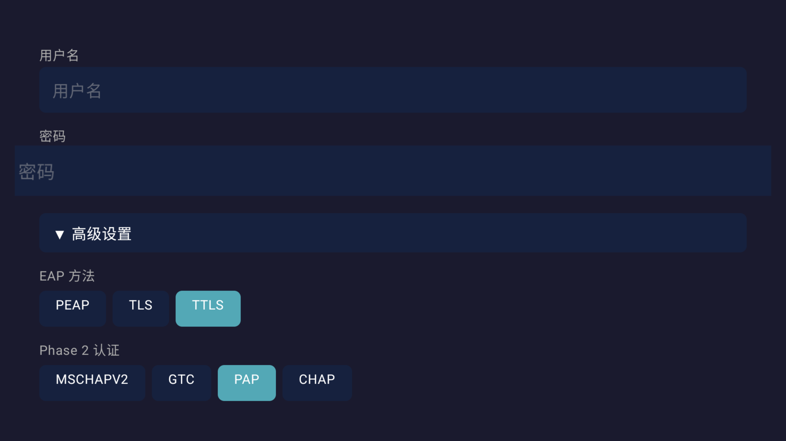
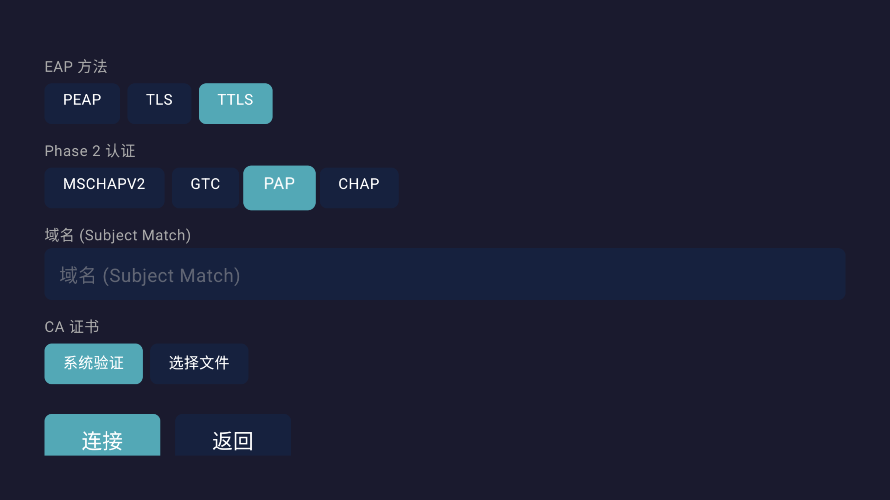

# EAP-WiFi Connector

为被阉割掉 WPA2-EAP 连接能力的 Android TV 设备提供企业 Wi-Fi 连接功能。

[English](README.md)

## 功能

- **自动扫描企业网络** — 启动后自动扫描并列出附近的 WPA2-EAP / 802.1X 企业 Wi-Fi 网络
- **手动输入隐藏网络** — 支持手动输入 SSID 连接未广播的隐藏企业网络
- **完整 EAP 认证支持** — 支持 PEAP、TLS、TTLS 方法及 MSCHAPV2、GTC、PAP、CHAP Phase2 认证
- **CA 证书管理** — 支持系统证书验证或手动选择 CA 证书文件（PEM/DER）
- **TV 遥控器优化** — 使用 Jetpack Compose for TV 构建，D-pad 焦点导航，大字号高对比界面
- **分步向导** — 选择网络 → 填写凭据 → 连接状态，每步聚焦单一任务

## 截图

| 选择网络 | 填写凭据 | 高级设置 |
|:---:|:---:|:---:|
|  |  |  |

## 构建

```bash
./gradlew assembleDebug
./gradlew assembleRelease
```

需要 JDK 17。

## 测试设备

- Xiaomi TV
