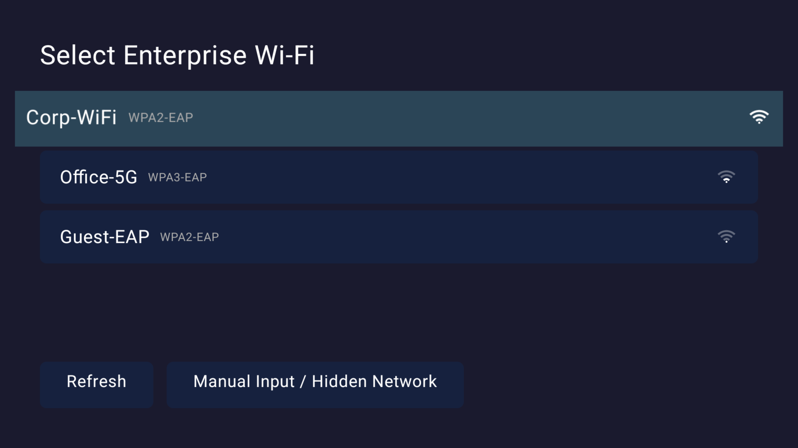

# EAP-WiFi Connector

Provides WPA2-EAP enterprise Wi-Fi connectivity for Android TV devices that have had this capability removed by the manufacturer.

[中文文档](README.CN.md)

## Features

- **Auto-scan enterprise networks** — Automatically scans and lists nearby WPA2-EAP / 802.1X enterprise Wi-Fi networks on launch
- **Manual input for hidden networks** — Supports manual SSID entry for connecting to hidden enterprise networks
- **Full EAP authentication support** — Supports PEAP, TLS, TTLS methods with MSCHAPV2, GTC, PAP, CHAP Phase2 authentication
- **CA certificate management** — Supports system certificate validation or manually selecting a CA certificate file (PEM/DER)
- **TV remote optimized** — Built with Jetpack Compose for TV, D-pad focus navigation, large text and high-contrast UI
- **Step-by-step wizard** — Select network → Enter credentials → Connection status, each step focused on a single task

## Screenshots

|                        Select Network                         | Credentials | Advanced Settings |
|:-------------------------------------------------------------:|:---:|:---:|
|  |  |  |

## Build

```bash
./gradlew assembleDebug
./gradlew assembleRelease
```

Requires JDK 17.

## Tested Devices

- Xiaomi TV
